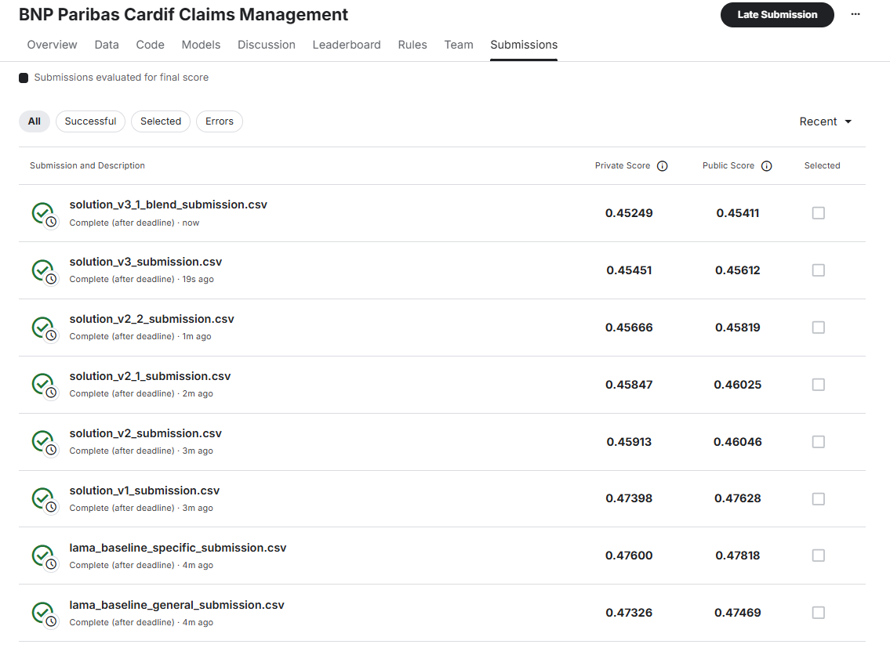

# BNP Paribas Cardif Claims Management: AutoML vs Custom Pipeline

Этот репозиторий содержит решение задачи классификации в рамках соревнования [BNP Paribas Cardif Claims Management](https://www.kaggle.com/competitions/bnp-paribas-cardif-claims-management).

**Цель проекта:** В рамках учебного курса продемонстрировать возможности библиотеки **LightAutoML (LAMA)**, а затем превзойти её результат, построив собственный пайплайн с углубленным Feature Engineering'ом.

## Решение
Решение представлено в [automl.ipynb](automl.ipynb) 

## 📊 Описание задачи

*   **Тип задачи:** Бинарная классификация.
*   **Метрика:** LogLoss (чем меньше, тем лучше).
*   **Данные:** Анонимизированный набор данных со множеством пропусков и категориальных признаков высокой кардинальности.

## 🛠️ Эксперименты (8 решений)

Проект разбит на 8 итеративных шагов — от автоматического бейзлайна до сложного ансамбля.

### Часть 1: AutoML Baseline
1.  **`lama_baseline_general`**: Запуск LightAutoML с тайм-лимитом 3600 сек. Использован полный перебор алгоритмов и 2-уровневый стекинг.
2.  **`lama_baseline_specific`**: Облегченная версия (600 сек) с ограничением только на градиентный бустинг (LGBM + CatBoost).

### Часть 2: Custom Pipeline (Evolution)
3.  **`solution_v1` (Base XGBoost)**: Простой пайплайн с Ordinal Encoding. Используется как отправная точка.
4.  **`solution_v2` (Feature Engineering)**:
    *   Добавлен признак `nan_count`.
    *   Применен **Count Encoding** для признака `v22`.
    *   *Результат:* Резкий скачок качества, уверенный обход AutoML.
5.  **`solution_v2_1` (Interactions)**: Автоматический поиск пар признаков через *Mutual Information*. Добавлены взаимодействия вида `v22_featureX`.
6.  **`solution_v2_2` (Tuning)**: Оптимизация гиперпараметров XGBoost с помощью **Optuna** (Bayesian Optimization).
7.  **`solution_v3` (Diversity)**: Внедрение **ExtraTreesClassifier** (Bagging). Модель имеет другую природу ошибок по сравнению с бустингом.
8.  **`solution_v3_1` (Blending)**: Финальный ансамбль (XGBoost + ExtraTrees). Веса подобраны через минимизацию LogLoss методом `scipy.optimize`.

## 🏆 Результаты

Финальное решение (Blending) превзошло лучший бейзлайн AutoML более чем на **0.02 LogLoss**, что является значительным отрывом.

| Решение | Описание | CV Score (OOF) | Private LB Score | Public LB Score | Статус |
|:---|:---|:---:|:---:|:---:|:---:|
| **Solution v3.1** | **Blending (XGB + ExtraTrees)** | **0.45493** | **0.45249** | **0.45411** | 🏆 **Best** |
| Solution v3 | ExtraTrees Classifier | 0.45786 | 0.45451 | 0.45612 | |
| Solution v2.2 | XGBoost Tuned (Optuna) | 0.45984 | 0.45666 | 0.45819 | |
| Solution v2.1 | XGBoost + Interactions | 0.46144 | 0.45847 | 0.46025 | |
| Solution v2 | XGBoost + Count Enc | 0.46245 | 0.45913 | 0.46046 | ✅ Beat LAMA |
| **LAMA General** | **AutoML Baseline (Heavy)** | **0.47526** | **0.47326** | **0.47469** | *Baseline* |
| Solution v1 | XGBoost Base | 0.47804 | 0.47398 | 0.47628 | |
| LAMA Fast | AutoML (Light) | 0.47914 | 0.47600 | 0.47818 | |

### Подтверждение результатов (Kaggle LB)
Порядок моделей на лидерборде полностью совпадает с локальной валидацией.

